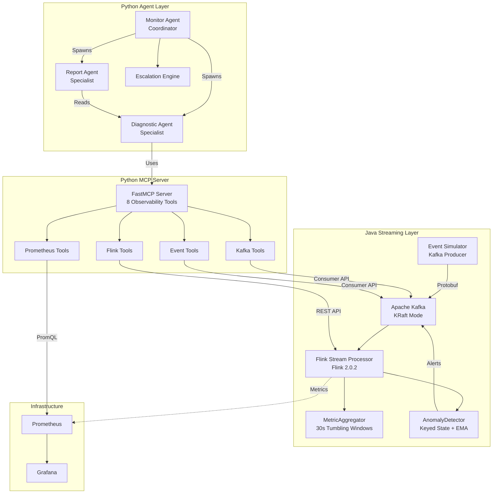
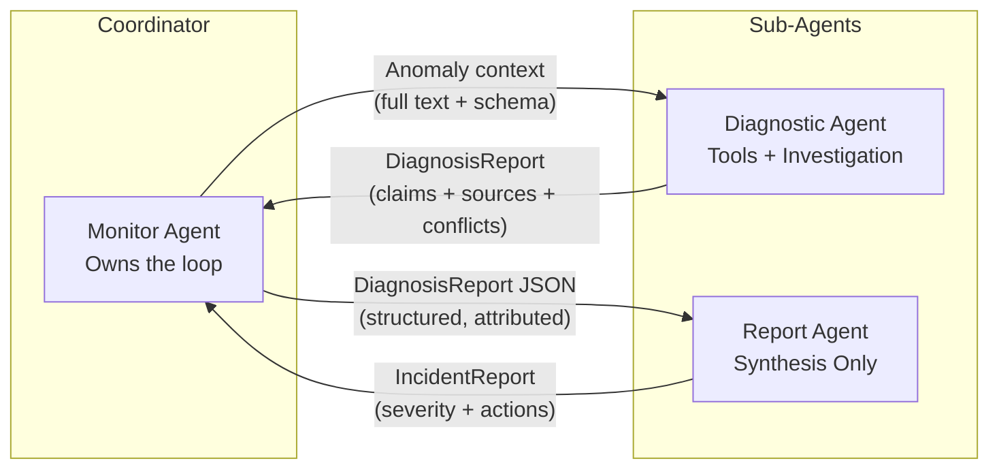
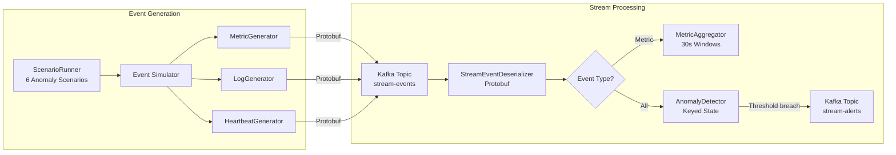
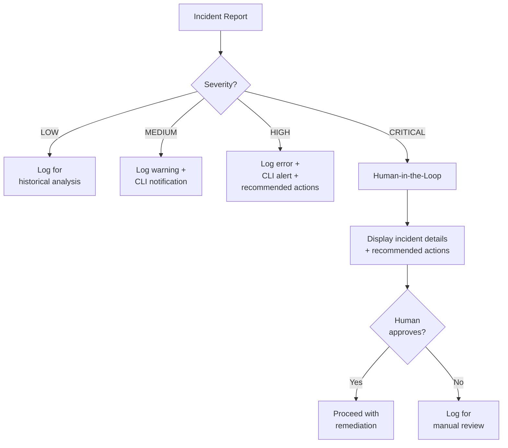
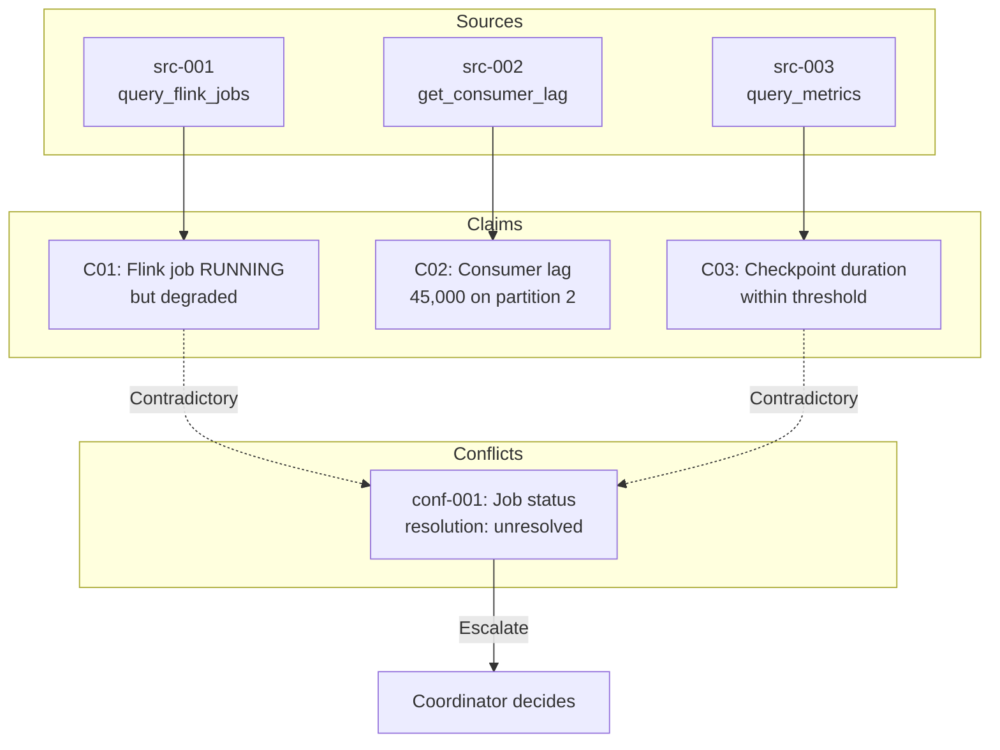
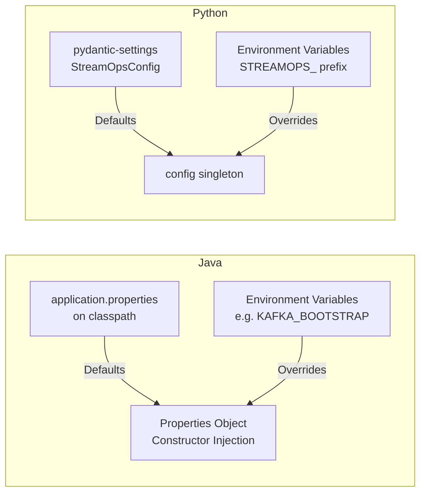

# StreamOps Agent

AI-powered operations agent for streaming infrastructure monitoring. Built with Apache Flink 2.0, Kafka, and Claude to detect anomalies, diagnose root causes, and escalate incidents in real-time pipelines.

## Architecture Overview



## Multi-Agent Topology

Hub-and-spoke pattern: the Monitor Agent is the coordinator. Sub-agents start with zero context; all information is injected via structured prompts.



## Agentic Loop

The core loop is driven by Claude's `stop_reason`. The agent keeps calling tools until it decides it has enough information.


## Data Flow



## Escalation Flow



## Claim-Source Attribution

Every diagnostic finding traces back to the tool and data that produced it. Conflicts between sources are annotated and escalated to the coordinator, never silently resolved.



## Configuration Hierarchy

Both Java and Python follow the same principle: defaults in file, override via environment.



## Project Structure

```
streamops-agent/
  java/
    proto/                    # Protobuf schema (StreamEvent)
    event-simulator/          # Standalone Kafka producer, 6 anomaly scenarios
    stream-processor/         # Flink 2.0 job (MetricAggregator + AnomalyDetector)
  mcp-server/
    src/streamops_mcp/
      tools/                  # 8 MCP observability tools (Flink, Kafka, Prometheus, Events)
      agent/
        monitor.py            # Coordinator agent (agentic loop, sub-agent spawning)
        escalation.py         # Severity routing + HITL
        executor.py           # Tool dispatch bridge
        tools.py              # Claude API tool definitions (scoped per agent role)
        schemas/              # Pydantic models (DiagnosisReport, IncidentReport)
        main.py               # CLI entry point
      config.py               # pydantic-settings config
    tests/                    # 53 Python tests
  docker-compose.yml          # Kafka KRaft, Flink JM+TM, Prometheus, Grafana
```

## Test Coverage

| Module | Tests | Framework |
|--------|-------|-----------|
| Event Simulator | 20 | JUnit 5, AssertJ |
| Stream Processor | 14 | JUnit 5, AssertJ, Mockito |
| MCP Server + Agent | 53 | pytest |
| **Total** | **87** | |

## Quick Start

```bash
# Start infrastructure
docker compose up -d

# Build Java modules
cd java && mvn clean package -DskipTests

# Start event simulator
java -jar event-simulator/target/event-simulator-0.1.0-SNAPSHOT.jar

# Start Flink processor (submit to running Flink cluster)
# See yarn scripts for orchestration

# Start MCP server
cd mcp-server && uv run python -m streamops_mcp.server

# Run the agent
cd mcp-server && uv run python -m streamops_mcp.agent.main
```

## Cert Reference

This project demonstrates patterns from the Claude Certified Architect exam:

| Pattern | Domain | Implementation |
|---------|--------|----------------|
| Agentic loop (stop_reason driven) | 1 | `monitor.py:_detect_anomalies()` |
| Tool use (MCP tools) | 1 | `executor.py`, `tools.py` |
| Structured output (Pydantic) | 1 | `schemas/diagnosis.py`, `schemas/incident.py` |
| Multi-agent coordinator | 1 | `monitor.py:MonitorAgent` |
| Sub-agent context injection | 1.3 | `monitor.py:_spawn_diagnostic_agent()` |
| Claim-source attribution | 1.3 | `schemas/diagnosis.py:ClaimRecord + SourceRecord` |
| Conflict annotation + escalation | 1.3 | `schemas/diagnosis.py:ConflictRecord` |
| Session isolation (blank sub-agents) | 1.7 | `monitor.py:_spawn_*_agent()` |
| Human-in-the-loop | 1 | `escalation.py:_handle_critical()` |
| Config externalization | -- | `config.py`, `application.properties` |
