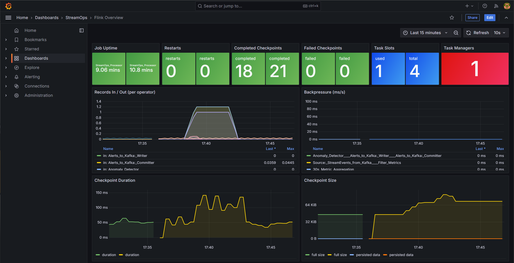
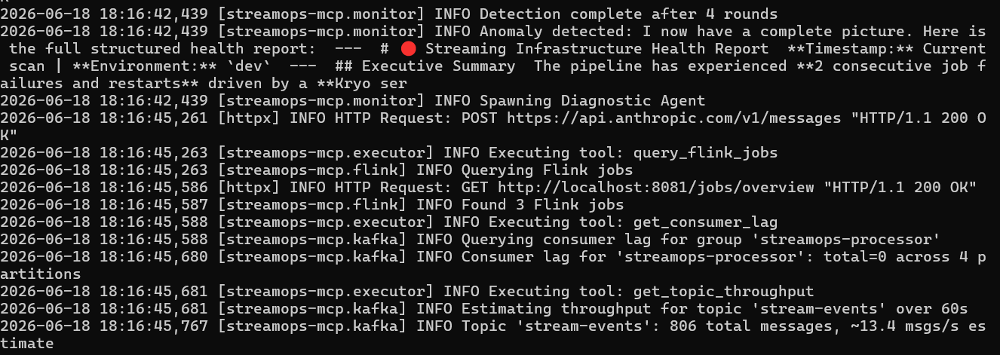
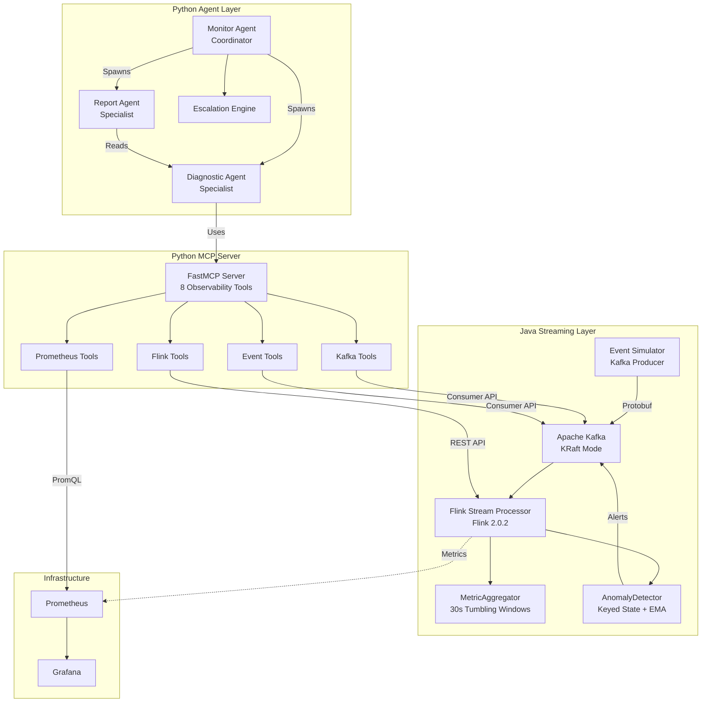
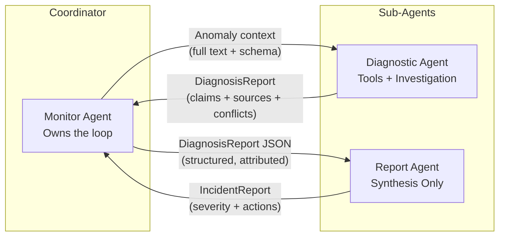
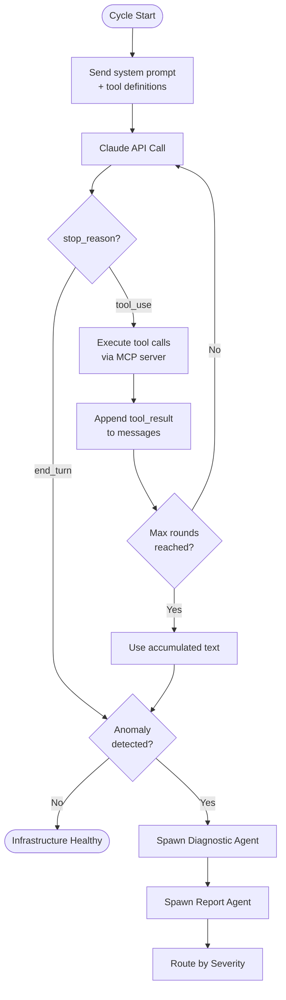
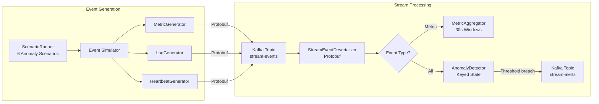
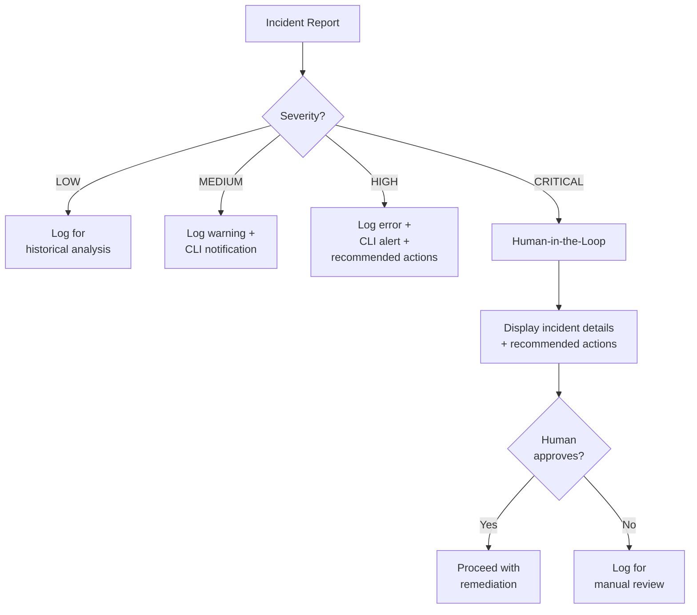
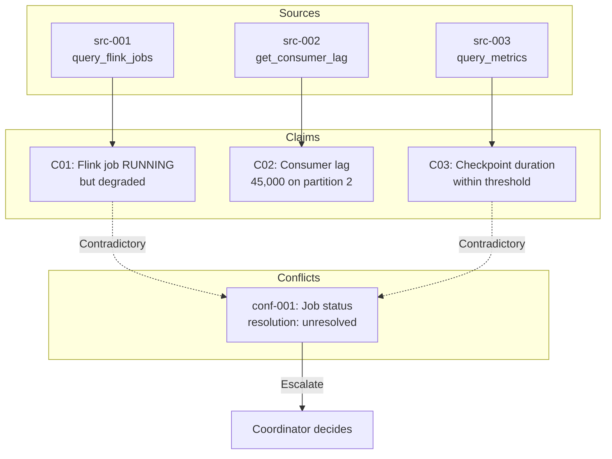
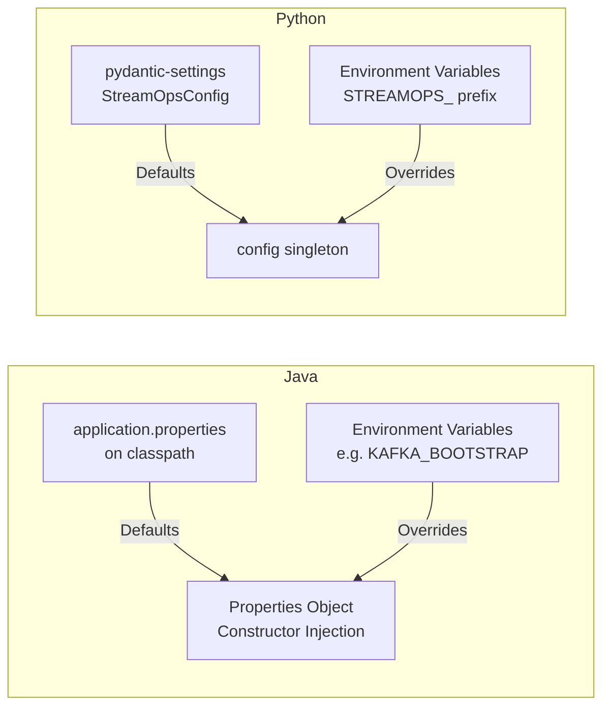

# StreamOps Agent

[](https://github.com/atomicdragonranch/streamops-agent/actions/workflows/ci.yml)
[](LICENSE)
[](https://openjdk.org/)
[]()

AI-powered operations agent for streaming infrastructure monitoring. Built with Apache Flink 2.0, Kafka, and Claude to detect anomalies, diagnose root causes, and escalate incidents in real-time pipelines.

### Live Observability

Provisioned Grafana dashboard showing Flink job health, checkpoint performance, backpressure, and JVM metrics. All panels are auto-populated from Prometheus scrapes of the running Flink cluster.



### Anomaly Detection in Action

The monitor agent runs a health check using MCP tools (Flink REST API, Kafka consumer groups, Prometheus metrics), detects an anomaly, and hands off to a diagnostic sub-agent for independent investigation. Here, it caught two consecutive job failures caused by a Kryo serialization issue and spawned the diagnostic agent to verify the root cause.



## Architecture Overview



## Multi-Agent Topology

Hub-and-spoke pattern: the Monitor Agent is the coordinator. Sub-agents start with zero context; all information is injected via structured prompts.



## Agentic Loop

The core loop is driven by Claude's `stop_reason`. The agent keeps calling tools until it decides it has enough information.



## Data Flow



## Escalation Flow



## Claim-Source Attribution

Every diagnostic finding traces back to the tool and data that produced it. Conflicts between sources are annotated and escalated to the coordinator, never silently resolved.



## Configuration Hierarchy

Both Java and Python follow the same principle: defaults in file, override via environment.



## Project Structure

```
streamops-agent/
  java/
    flink-parent/             # Shared Flink dependency management (Maven parent POM)
    proto/                    # Protobuf schema (StreamEvent)
    event-simulator/          # Standalone Kafka producer, 6 anomaly scenarios
    stream-processor/         # Flink 2.0 job (MetricAggregator + AnomalyDetector)
  mcp-server/
    src/streamops_mcp/
      tools/                  # 8 MCP observability tools (Flink, Kafka, Prometheus, Events)
      agent/
        monitor.py            # Coordinator agent (agentic loop, sub-agent spawning)
        escalation.py         # Severity routing + HITL
        executor.py           # Tool dispatch bridge
        tools.py              # Claude API tool definitions (scoped per agent role)
        schemas/              # Pydantic models (DiagnosisReport, IncidentReport)
        main.py               # CLI entry point
      config.py               # pydantic-settings config
    tests/                    # 53 Python tests
  config/
    prometheus.yml            # Scrape config for Flink JM + TM metrics
    grafana/provisioning/
      datasources/            # Auto-provisions Prometheus datasource
      dashboards/             # Flink Overview dashboard (auto-loaded)
  docs/images/                # Screenshots for README
  scripts/                    # Demo scenario runner
  .github/workflows/          # CI pipeline (test, lint, build)
  docker-compose.yml          # Kafka KRaft, Flink JM+TM, Kafka UI, Prometheus, Grafana
```

## Test Coverage

| Module | Tests | Framework |
|--------|-------|-----------|
| Event Simulator | 23 | JUnit 5, AssertJ |
| Stream Processor | 14 | JUnit 5, AssertJ, Mockito |
| MCP Server + Agent | 53 | pytest |
| **Total** | **90** | |

## Quick Start

### Prerequisites

- **Docker Desktop** (with Docker Compose v2)
- **JDK 17+** for building and running Java modules
- **Python 3.11+** with [uv](https://docs.astral.sh/uv/) for the MCP server and agent
- **Maven 3.9+** for building the Java modules

### 1. Start Infrastructure

```bash
docker compose up -d
```

This starts Kafka (KRaft mode), Flink (JobManager + TaskManager), Prometheus, Grafana, and Kafka UI. Topics are created automatically by the `kafka-init` container.

### 2. Build Java Modules

```bash
cd java && mvn clean package -DskipTests
```

### 3. Submit the Flink Job

```bash
docker exec streamops-flink-jm mkdir -p /opt/flink/jobs
docker cp java/stream-processor/target/stream-processor-0.1.0-SNAPSHOT.jar \
  streamops-flink-jm:/opt/flink/jobs/stream-processor.jar
docker exec streamops-flink-jm flink run -d /opt/flink/jobs/stream-processor.jar
```

### 4. Start the Event Simulator

```bash
java -jar java/event-simulator/target/event-simulator-0.1.0-SNAPSHOT.jar latency-spike
```

Available scenarios: `latency-spike`, `throughput-drop`, `error-burst`, `backpressure`, `checkpoint-timeout`, `memory-pressure`.

### 5. Run the AI Agent

Requires `ANTHROPIC_API_KEY` in your environment.

```bash
cd mcp-server && uv sync

# Single cycle: run one health check, then exit
uv run python -m streamops_mcp.agent.main --single-cycle

# Continuous monitoring: repeat every 60s until stopped
uv run python -m streamops_mcp.agent.main
```

All Python config has sensible defaults in `config.py` and can be overridden with `STREAMOPS_`-prefixed environment variables (e.g., `STREAMOPS_AGENT_MONITOR_INTERVAL=30`, `STREAMOPS_KAFKA_BOOTSTRAP=kafka:29092`). Java config works the same way: defaults in `application.properties`, overridden by env vars like `KAFKA_BOOTSTRAP`.

### Web Dashboards

Once the stack is running, these dashboards are available in your browser:

| Dashboard | URL | Purpose |
|-----------|-----|---------|
| **Flink Dashboard** | http://localhost:8081 | Job status, task managers, checkpoints, backpressure, exceptions |
| **Kafka UI** | http://localhost:8080 | Browse topics, view messages, consumer groups, partition layout |
| **Prometheus** | http://localhost:9090 | Raw metrics, PromQL queries, target health |
| **Grafana** | http://localhost:3333 | Pre-configured dashboards for Flink metrics (admin/streamops) |

### Troubleshooting

**Flink job fails with "Failed to create checkpoint storage"**

The checkpoint directory inside the Flink containers may not have write permissions on first run. Fix with:

```bash
docker exec streamops-flink-jm bash -c "mkdir -p /tmp/flink-checkpoints && chmod 777 /tmp/flink-checkpoints"
docker exec streamops-flink-tm bash -c "mkdir -p /tmp/flink-checkpoints && chmod 777 /tmp/flink-checkpoints"
```

Then resubmit the job (see step 3 above).

**Flink job restarts with "Connection to node localhost:9092 could not be established"**

The stream processor defaults to `localhost:9092` for Kafka, which works on the host but not inside Docker containers. The `docker-compose.yml` sets `KAFKA_BOOTSTRAP=kafka:29092` on both Flink containers to override this. If you see this error, verify the env var is set:

```bash
docker exec streamops-flink-tm printenv KAFKA_BOOTSTRAP
# Should output: kafka:29092
```

If it's missing, recreate the containers: `docker compose down && docker compose up -d`.

**Simulator fails with "UnsupportedClassVersionError"**

The Java modules are compiled with JDK 17 target. If your default `java` on PATH is older than JDK 17, run the simulator with an explicit path:

```bash
# Find your JDK 17+ installation
$JAVA_HOME/bin/java -jar java/event-simulator/target/event-simulator-0.1.0-SNAPSHOT.jar
```

**Port 3000 (or 3333) already in use**

Another application is using the Grafana port. Edit `docker-compose.yml` and change the host port mapping for the `grafana` service (e.g., `"3333:3000"` to `"4000:3000"`).

**Simulator produces events but Flink shows LAG = 0 and no alerts**

This is normal during warm-up. The AnomalyDetector uses exponential moving averages (EMA) that need several data points before triggering. Run the simulator for at least 30 seconds with an anomaly scenario, then check the `stream-alerts` topic in Kafka UI.

## Architectural Patterns

| Pattern | Implementation |
|---------|----------------|
| Agentic loop (stop_reason driven) | `monitor.py:_detect_anomalies()` |
| Tool use (MCP tools) | `executor.py`, `tools.py` |
| Structured output (Pydantic) | `schemas/diagnosis.py`, `schemas/incident.py` |
| Multi-agent coordinator (hub-and-spoke) | `monitor.py:MonitorAgent` |
| Sub-agent context injection | `monitor.py:_spawn_diagnostic_agent()` |
| Claim-source attribution | `schemas/diagnosis.py:ClaimRecord + SourceRecord` |
| Conflict annotation + escalation | `schemas/diagnosis.py:ConflictRecord` |
| Session isolation (blank sub-agents) | `monitor.py:_spawn_*_agent()` |
| Human-in-the-loop | `escalation.py:_handle_critical()` |
| Config externalization | `config.py`, `application.properties` |
